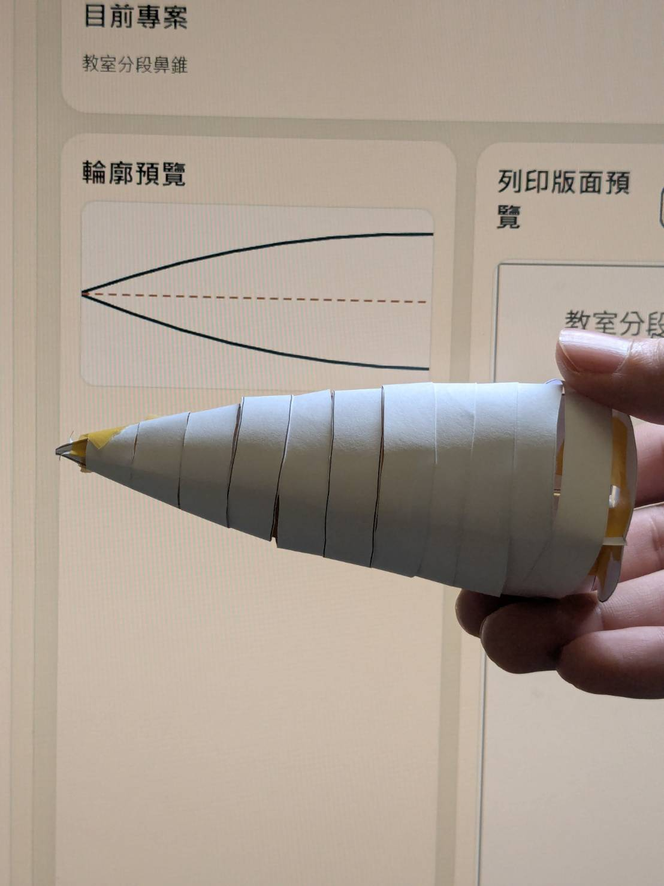
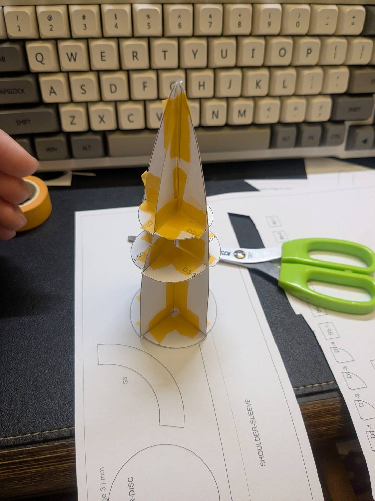
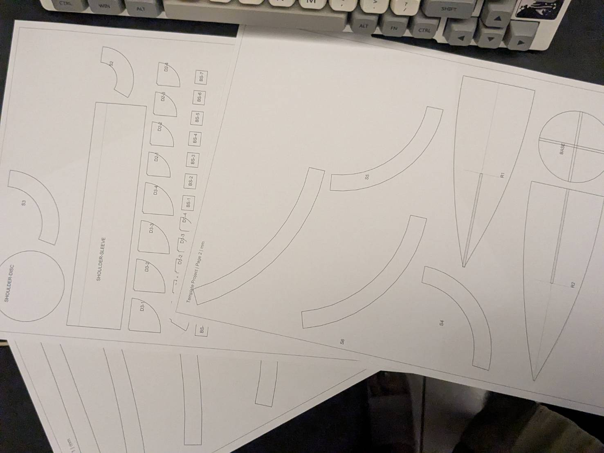
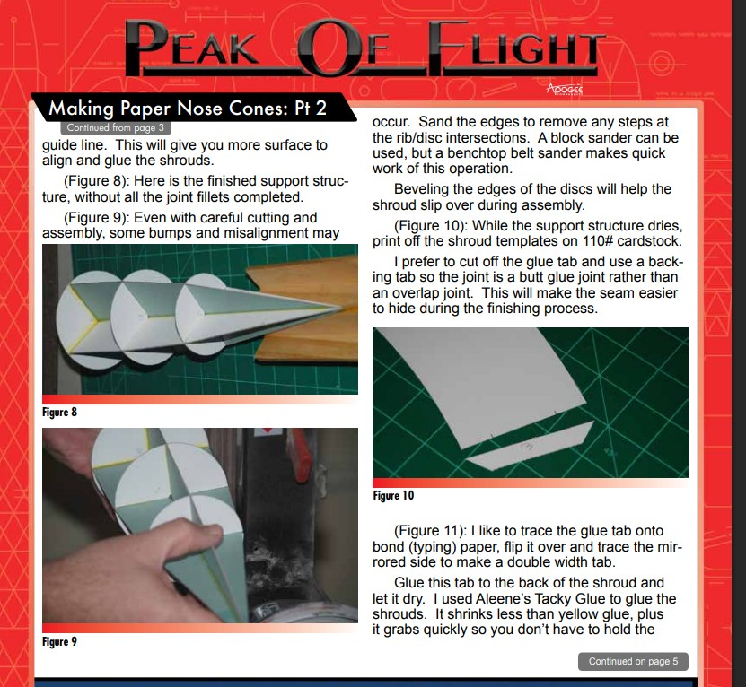

# openrocket-nosecone-unfolder-offline

An offline nose-cone/transition template tool (runs by opening `index.html` directly), based on Apogee Newsletter 410:
- https://www.apogeerockets.com/education/downloads/Newsletter410.pdf

## What it does
- Generate printable templates from manual nose-cone/transition parameters
- Import OpenRocket `.ork` files (browser-side parsing)
- Produce segmented shrouds, backing strips, ribs, support discs, and shoulder/coupler parts (nose cone)
- Preview page layout and export `SVG`, `PDF`, and `ZIP`
- Run fully offline with `file://`

## Quick start
1. Install Node.js 18+
2. In project root, run:
   - `npm install`
   - `npm run build`
   - `npm run offline-dist`
3. Open `offline-dist/index.html`

## Basic workflow
1. Load an example or enter parameters
2. Optionally import a `.ork` file
3. Check preview and piece list
4. Click `Export PDF`, `Export SVG`, or `Export ZIP`
5. Print at 100% scale and verify the 20 mm calibration square before cutting

## Photos
The first three images are real build photos. The fourth image is the Newsletter 410 reference page.

For technical details, see [architecture.md](./architecture.md).
